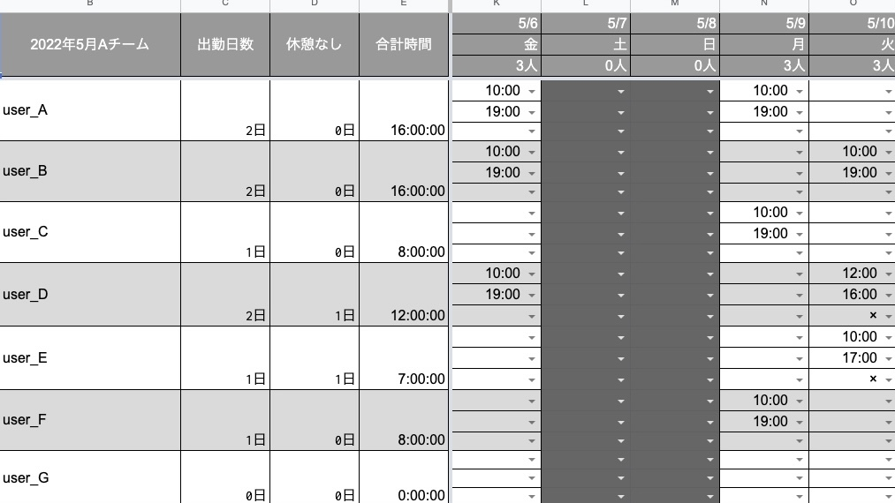

# shift-generater

GAS script for spreadsheets to quickly create shift tables.<br>
Please use the shared link below to open the spreadsheet and make a copy.

## SpreadSheet
[shift-generater](https://docs.google.com/spreadsheets/d/18PYbOXrRExwwhnOL5MUdq_xH1ioKewH-Mi-3fPOeEGc/edit?usp=sharing)

## How to use
1. Duplicate the spreadsheet below in your local environment.
2. Open Google AppScript by selecting 'Apps Script' from Extensions.
3. Copy and paste the code in 'main.js'.
4. Check the operation and approve the execution authority.

## Extra 
For those who wish to perform simple time and attendance management, place the following code anywhere in main.js and create a button to activate the sheet and function.

```
function manageAttendance() {
  const entrySheet = SpreadsheetApp.getActiveSpreadsheet().getSheetByName('記入');
  const logSheet = SpreadsheetApp.getActiveSpreadsheet().getSheetByName('ログ');
  const name = entrySheet.getRange('B1').getValue();
  const status = entrySheet.getRange('B2').getValue();
  const lastRow = logSheet.getLastRow() + 1;
  const lastColumName = `A${lastRow}`;
  const lastColumStatus = `B${lastRow}`;
  const lastColumTime = `C${lastRow}`;
  const date = new Date();

  logSheet.getRange(lastColumName).setValue(name);
  logSheet.getRange(lastColumStatus).setValue(status);
  logSheet.getRange(lastColumTime).setValue(date);
}
```

**Enjoy using this spreadsheet!**

## License
MIT
